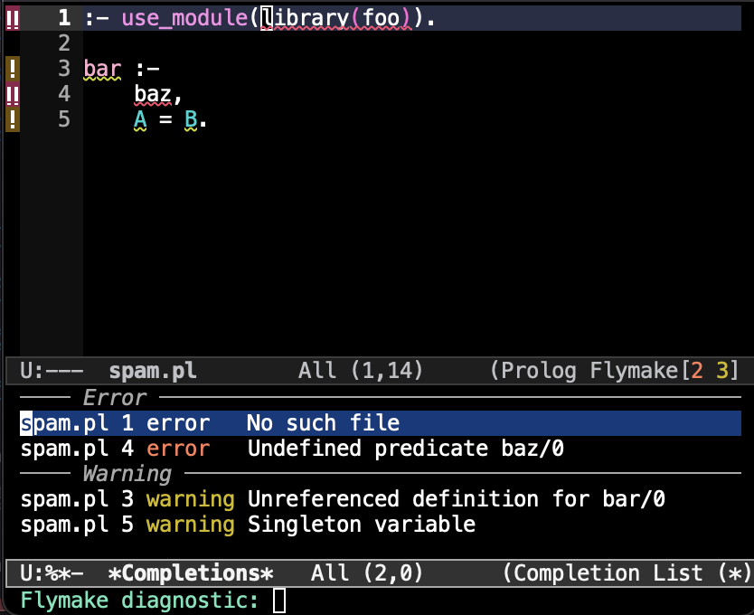

# flymake-swi-prolog

[](https://melpa.org/#/flymake-swi-prolog)

Flymake backend for SWI-Prolog using [diagnostics.pl](https://git.sr.ht/~eshel/diagnostics.pl)



## Perquisites

Install SWI-Prolog, e.g. from [here](https://www.swi-prolog.org/Download.html).

## Installation

### From package archive

To install from MELPA, simply type:

    M-x package-install RET flymake-swi-prolog RET


### From Git repository

Clone the [source repository](https://git.sr.ht/~eshel/flymake-swi-prolog) to a direcory of your choice:
```sh
$ cd ~/.emacs.d/checkouts/
$ git clone https://git.sr.ht/~eshel/flymake-swi-prolog
```

Then add the root of the newly cloned repository to the `load-path` in Emacs with e.g.:
```lisp
;;; init.el
(add-to-list 'load-path "~/.emacs.d/checkouts/flymake-swi-prolog")
```

## Setup

Add `flymake-swi-prolog` to your `init.el` and hook it to
be used automatically in `prolog-mode` buffers:
```lisp
(require 'flymake-swi-prolog)
(add-hook 'prolog-mode-hook #'flymake-swi-prolog-setup-backend)
```

Install the required Prolog `diagnostics` package with either:
```lisp
M-x flymake-swi-prolog-ensure-backend
```

or run from the command line:

```sh
$ swipl -g "pack_install(diagnostics)" -t halt
```

## Usage

Just open a file in `prolog-mode` and you should be ready to go.


## Contributing

For questions, requests, patches, please write to
[~eshel/dev@lists.sr.ht](mailto:~eshel/dev@lists.sr.ht) specifying the name of this repository in
mail subject, e.g. `[PATCH flymake-swi-prolog] fix it`.
